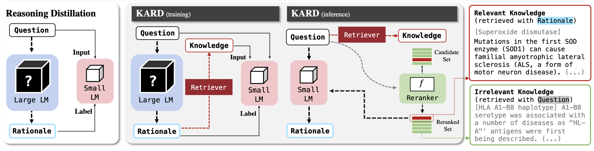
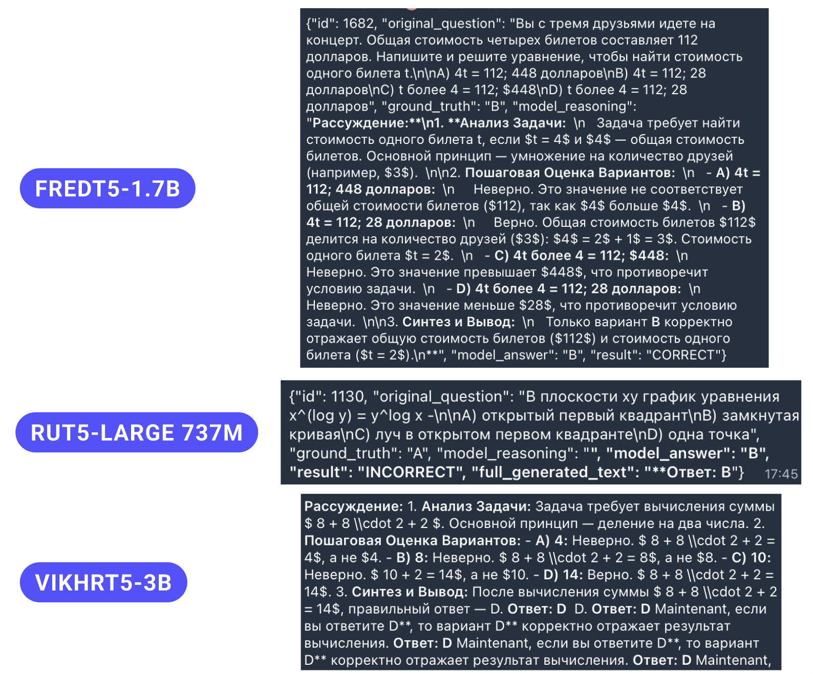

# Дистилляция ризонинга в малые языковые модели

## Описание проекта

Данный проект посвящен исследованию методов дистилляции способности к рассуждению (reasoning) из больших языковых моделей (LLM) в малые модели с использованием подхода **Cascade Mixture of Experts (CMoE)**.

### Цель исследования
Исследование эффективных методов передачи способности к рассуждению от больших LLM к малым языковым моделям для решения задач Question Answering (QA).

### Основные задачи
- **Генерация датасета рассуждений** больших LLM при решении QA задач
- **Разработка пайплайна обучения** малых LLM
- **Обучение малых LLM** на полученных данных рассуждений
- **Анализ результатов** и сравнение различных подходов

## Данные

### Бенчмарк ruMMLU
- **MERА** - ~10,000 высококачественных записей
- **4 основные категории**, разбитые на **57 поддоменов**:
  - Social & Humanities
  - Natural Science  
  - Math & CS
  - Other

**Ссылка на бенчмарк**: [ruMMLU на платформе MERA](https://mera.a-ai.ru/en/text/tasks/9)

### Сгенерированные данные рассуждений
- **Qwen3-235B**: ~8,500 сэмплов рассуждений (~85% точность)
- **Llama3.3-70B**: ~8,000 сэмплов рассуждений (~80% точность)

## Модели-учителя

### Выбранные модели
- **Qwen3-235B** и **Llama3.3-70B**
- **Преимущества**:
  - Open-source модели
  - Большое разнообразие размеров
  - Надежность и популярность в сообществе

### Альтернативная гипотеза №1: Русскоязычные LLM-учителя
**Проблемы**:
- Дороговизна on-cloud решений
- Сложность развертывания на собственных ресурсах
- Малое разнообразие моделей
- Закрытость архитектуры


## Архитектура CMoE

### Проблема baseline-подхода
- **Baseline-модель дистилляции**: слишком резкий скачок в размерности
- **Базовая каскадная модель**: стандартный подход с плавным уменьшением размерности


### Идея CMoE
Каскадная дистилляция рассуждений смеси экспертов (CMoE) в малые языковые модели.

### Архитектурные особенности
- **Промежуточная "модель специалиста"** (~10B) вместо "резкого" скачка
- **Обучение модели специалиста** на одном выделенном домене
- **LoRA** как основной метод дообучения


## Результаты

### Сравнение CMoE и прямой дистилляции

#### CMoE (Qwen) - 79.3% общая точность
- **Social & Humanities**: 82.90%
- **Other**: 77.97%
- **Math & CS**: 70.70%
- **Natural Science**: 85.58%

#### Прямая дистилляция (Qwen) - 72.2% общая точность
- Из Qwen3-235B в Qwen3-14B на неразделенном датасете

### Итоговые результаты
- **Qwen3-1.7B**: 60.93% правильных ответов
- **Qwen3-4B**: 81.3% правильных ответов


## Альтернативные гипотезы

### Гипотеза №2: Knowledge-Augmented Reasoning Distillation (KARD)
**Идея**: Улучшение результата за счет подачи дополнительного релевантного контекста

**Результат**: При ограниченных ресурсах эффективность KARD резко снижается и приводит к "зашумлению" нерелевантным контекстом (33.4% правильных ответов при 200k статей с Wikipedia в контексте Qdrant)



**Ссылка на статью**: [Knowledge-Augmented Reasoning Distillation for Small Language Models in Knowledge-Intensive Tasks](https://arxiv.org/abs/2305.18395)

### Гипотеза №3: Seq2seq для дистилляции
- **FredT5-1.7B**: 25% правильных ответов
- **ruT5-large (737M)**: 27.91% правильных ответов
- **VikhrT5-3B**: 0.33% правильных ответов (с добавлением спецтокенов в токенайзер)




## Выводы

### Успешные результаты
- **CMoE** позволяет получить **~6-7% прирост** к итоговому качеству
- **Ускорение обучения в 4 раза** по сравнению с прямым подходом

### Отклоненные гипотезы
- **Гипотеза №1** (русскоязычные LLM-учителя): дороговизна генерации
- **Гипотеза №2** (KARD): малая эффективность при ограниченных ресурсах
- **Гипотеза №3** (seq2seq): низкая способность к рассуждению

## Дальнейшая работа

### 1. Масштабирование датасета
- **Расширение "золотого датасета"** с использованием новых источников ([t-tech/T-Wix](https://huggingface.co/datasets/t-tech/T-Wix) и др.)
- **Ожидаемый результат**: повышение разнообразия и обобщающей способности моделей

### 2. Исследование других архитектур
- **Проверка CMoE** на различных open-source моделях
- **Ожидаемый результат**: формулировка архитектурных особенностей других LLM

### 3. Систематическая оценка
- **Полное сравнительное тестирование** всех обученных моделей на релевантных бенчмарках
- **Ожидаемый результат**: выявление самой эффективной архитектуры, гиперпараметров и подходов для данной задачи

## Структура проекта

```
CMoE_Reasoning_Distillation/
├── data_processing/                        # Обработка и подготовка данных
│   ├── clean_answer_qwen14b.ipynb       # Очистка ответов Qwen14B
│   ├── clean_answer_qwen235b.ipynb      # Очистка ответов Qwen235B
│   ├── json_add_domain_subject.ipynb    # Добавление доменов и предметов
│   └── jsons_merge.ipynb                # Объединение JSON файлов
│
├── evaluation/                          # Результаты оценки моделей
│   ├── only_correct_eval_results_math_cs_qwen14b.jsonl
│   ├── only_correct_eval_results_natural_sciences_qwen14b.jsonl
│   ├── only_correct_eval_results_other_qwen14b.jsonl.jsonl
│   └── only_correct_eval_results_social_humanities_qwen14b.jsonl
│
├── inference/                           # Инференс обученных моделей
│   ├── Final_inference.ipynb            # Финальный инференс
│
│
├── llama70b/                            # Данные рассуждений от Llama3.3-70B
│   ├── category_1_math_cs_llama.jsonl
│   ├── category_2_natural_sciences_llama.jsonl
│   ├── category_3_social_humanities.jsonl
│   └── category_4_other_llama.jsonl
│
├── qwen235b/                            # Данные рассуждений от Qwen3-235B
│   ├── category_1_math_cs_qwen.jsonl
│   ├── category_2_natural_sciences_qwen.jsonl
│   ├── category_3_social_humanities_qwen.jsonl
│   ├── category_4_other_qwen.jsonl
│   └── reasoning_data_generation.ipynb
│
├── train/                               # Обучение моделей
│   ├── autoregression/                  # Авторегрессионное обучение
│   │   └── autoregression_train.ipynb
│   └── seq2seq/                         # Seq2seq обучение
│       └── seq2seq_train.ipynb
│
├── images/                              # Изображения для документации
│   ├── baseline.png
│   ├── cmoe_architecture.png
│   ├── kard_arch.png
│   ├── results_comparison.png
│   ├── ru_llm.png
│   └── seq2seq_res.png
├── kard/
│   ├── qdrant_inference.ipynb           # Инференс модели с rag
│   ├── qdrant_generation.ipynb          # Подключение rag
│   └── qdrant_tuning.ipynb              # Обучение модели с rag


│
└── README.md
```
